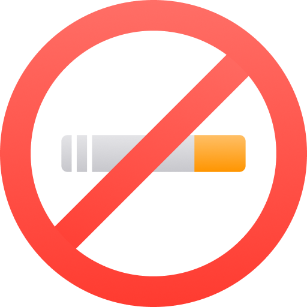
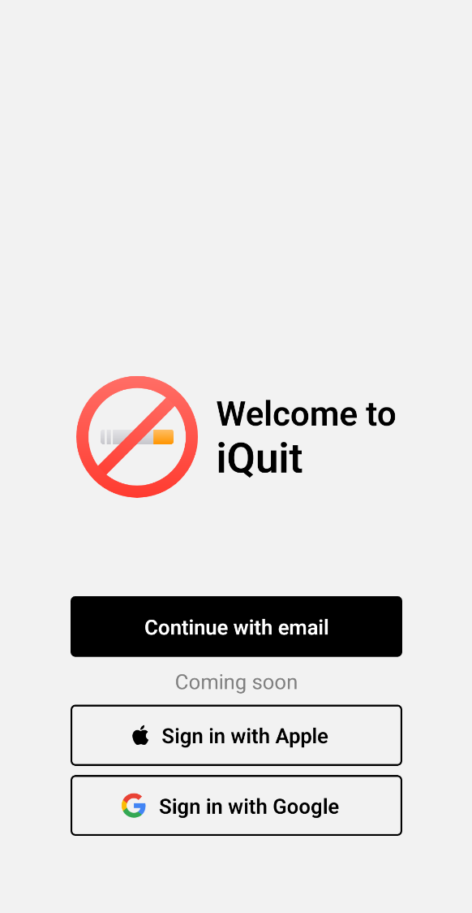
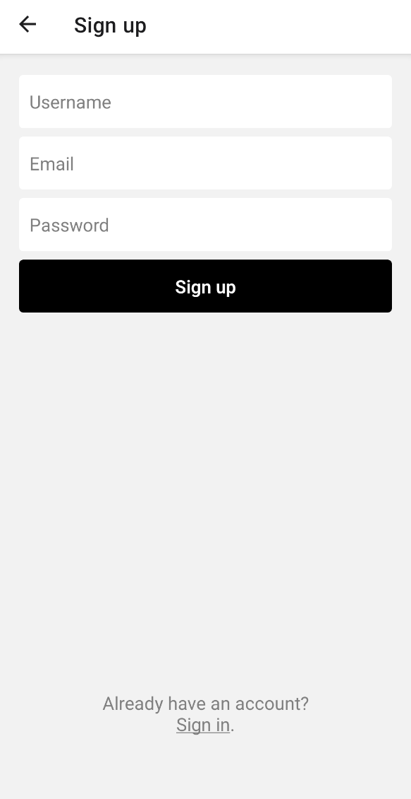
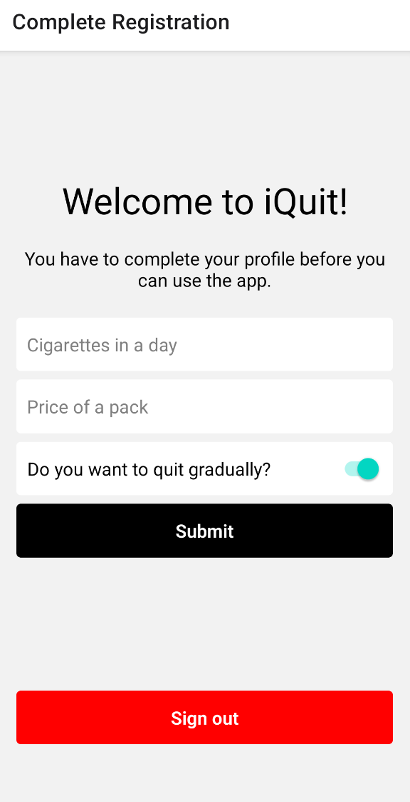
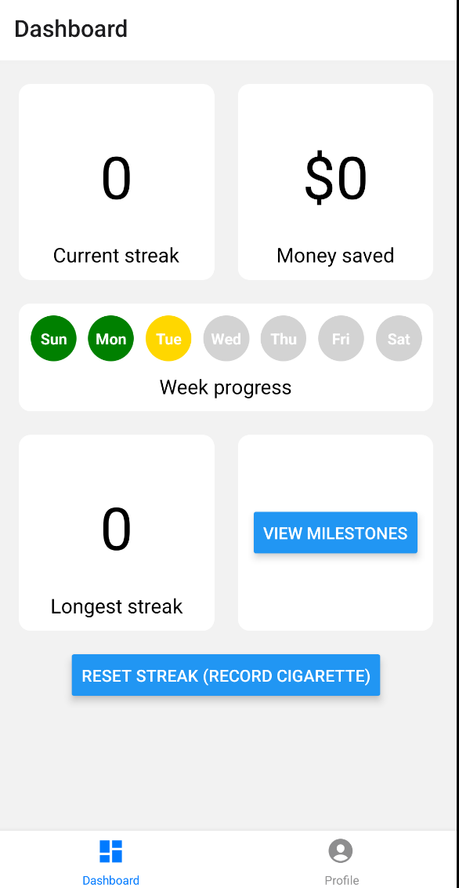
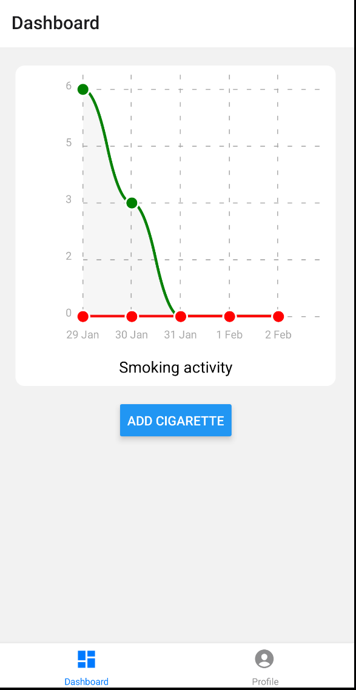
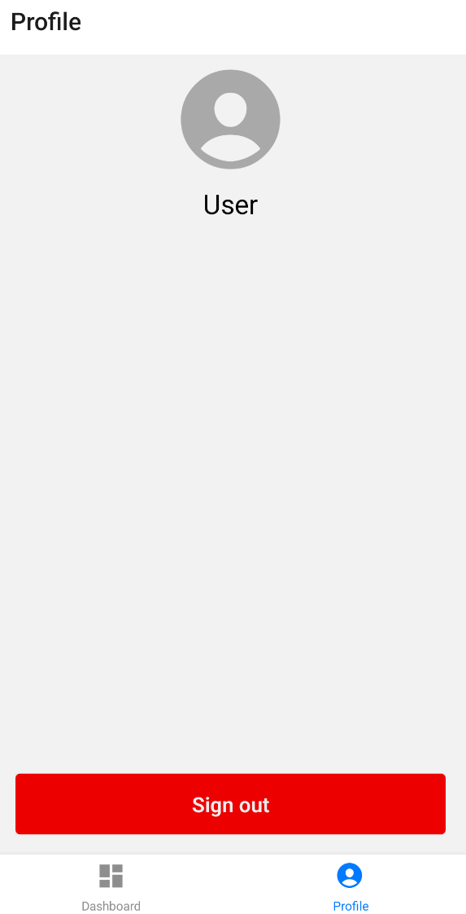

# iQuit - Quit Smoking mobile app

## Problem Statement

Smoking remains a pervasive health challenge, leading to numerous detrimental health effects and addictive behaviors. Despite the awareness of these risks, many individuals find it challenging to quit smoking due to the addictive nature of tobacco products. 

Our app provides users with the tools and support needed to gradually reduce and eventually eliminate smoking, leading to improved health and a smoke-free life.

## Product Vision

We want to create a mobile app to empower individuals on their journey to quit smoking.

By providing real-time monitoring and personalized intervention, the app aims to break the cycle of addiction, promote healthier lifestyles, and reduce the overall prevalence of smoking.

The product aims to achieve multiple goals that are crucial in order to reduce smoking and motivate the target audience:

- Achieve at least a 50% reduction in daily cigarette consumption within the first two weeks.
- Increase and monitor the money saved by reducing the quantity of cigarettes that the user would normally smoke.
- Maintain a user retention rate of at least 60% after the first three months of app usage.

## Product features & Functionalities + Product Roadmap:

https://miro.com/app/board/uXjVNNFVqzU=/

## Non-Functional Requirements

- Performance:
    The app's ability to respond and execute actions smoothly, 
    ensuring quick loading times and seamless user interaction 
    on both iOS and Android platforms.

- Specific:
    Achieve app loading times of 3 seconds or less across iOS 
    and Android devices

- Measurable: 
    Quantify response times for user actions within 1 second for 
    optimal user experience.
  
- Atainable:
    Following good coding practices and optimizing the app to meet
    specified requirements

- Realistic:
    With proper resource allocation and technological capabilities, 
    achieving these response times is feasible.

- Traceable:
    Tracking app response times using performance testing tools.

- Usability:
    The app's user interface should be intuitive, following each 
    platform's UI guidelines.

- Specific:
    Ensure an intuitive user interface and accessible design for 
    diverse user groups.

- Measurable: 
    Conduct usability testing to achieve high user satisfaction scores 

- Atainable:
    Implement user feedback and design improvements iteratively during 
    the development process.

- Realistic:
    Achieving high usability ratings is viable with comprehensive user 
    research and iterative design adjustments.

- Traceable:
    Track user feedback, conduct surveys, and analyze user interaction 
    patterns to gauge usability improvements.

## Customer Journey & User personas

https://miro.com/app/board/uXjVNMGsbDA=/

## Activity diagram

https://app.creately.com/d/DQzkIuwU0PO/edit

## User stories

- As a new user of the app, i want to login and set up my profile.

Feature: User Authentication & Profile Setup
Scenarios:

User login with Google/Facebook/Apple ID/Email

	Given the user is on login page
	When the user selects log in method
	Then redirect user to dashboard

User profile setup

	Given the user has logged in on the app for the first time
	When the user logged in with new social media account
	Then request data from user to create profile
	And set up profile successfully

- As a user, I want to log my daily smoking activities.

Feature: Daily Smoking log
Scenario: 

Logging Daily Smoking Activity

	Given the user is on the main dashboard
	When the user logs a smoking activity for the day
	Then the app should record the smoking activity
	And the log should be visible in the user's history

- As a user, I want to receive push notifications to remind me of my quitting goals.

Feature: Push Notifications
Scenario:

Receiving Goal Reminders

	Given the user has set quitting goals
	When it's time for a goal reminder
	Then the app should send a push notification to the user

- As a user, I want to see real-time visualizations of my smoking habits.

Feature: Monitoring Dashboard
Scenario:

Dashboard Visualization & Charts

	Given the user is on the monitoring dashboard
	When the user views the real-time visualizations
	Then the app should display up-to-date data on smoking habits 
	And draw diagrams/charts highlighting crucial data that has been logged during the journey

- As a developer, I want to document the code and features implemented during the first sprint.

Feature: Documentation
Scenario: Code Documentation

	Given the development team has completed features for the first sprint
	When developers write code documentation
	Then the documentation should be comprehensive and cover all implemented features

## Product backlog

1. User authentication
   
     As a user i want to log in easily using a social media platform.

Tasks:

- Implement authentication methods that work cross-platform
- Check if it is the first time user authenticates to create a new profile

Estimation of task: 10 points

2. Profile setup

     As a user after i logged in i want to customize my profile.

Tasks:

- Implement forms to request data from user such as name, age, some information about smoking history
- Send data to database

Estimation of task: 8 points

3. Logging

     As a user, I want to log my daily smoking activities.

Tasks:

- Implement action for user to take when smoking a cigarette 
- Count up smoke cigarettes per day
- Notify the user of his daily limits and purpose ensuring the consistency of progress

Estimation of task: 6 points

4. Notification service

     As a user, I want to receive push notifications to remind me of my quitting goals.

Tasks: 

- Develop logic of sending goal reminders based of missing action from the user
- Implement notification service that is not disturbing for user

Estimation of task: 6 points

5. Visualization

     As a user, I want to see an intuitive representation of my current progress.

Tasks:

- Query smoking history of the user and parse data intuitively
- Plot the data using a strong visual representation that the user can understand
- Highlight the highs and lows of the progress

Estimation of task: 8 points

6. Dashboard

     As a user, I want to have a main page to see the visualization, history and have multiple options to take care of my progress.

Tasks:

- Design intuitive dashboard that includes buttons for cigarette counting, show history etc.

Estimation of task: 5 points

7. Dcoumentation

     As a developer, I want to document the code and features implemented during the first sprint.

Tasks:

- Write code documentation.
- Create user documentation for onboarding and features

Estimation of task: 3 points

Total capacity: 46 points

Expected capacity: 30 points

## Sprint reports & architecture report

Those can be found [here](https://github.com/inginerie-software-2023-2024/proiect-inginerie-software-i-quit/tree/main/Sprint%20Reports)

## Application flow & Documentation

- Landing page 

The user will see a specific page when logged out or when he opens the application for the first time.

- Login/Register pages

The user can create an account and log in using the intuitive pages where he will be asked for a username, email and a password.
The login page looks the same but when logging in the username is not required anymore.

- Post-Registration page

The user will see on first-time login a page which will act as a profile customization page - this page collects important preferences from the user so that the application can display the corresponding plans desired.

- Direct plan dashboard 

If the user opted out for a direct quit-smoking plan then the dashboard will show the current streak, milestone data, the amount of money saved and the user has the options to reset the streak or to see the milestones.

- Gradual plan dashboard

If the user opted out for a gradual quit-smoking plan then the dashboard will show a chart that will reflect how many cigarettes we are allowed to smoke today and in the next days (red line) and how many we smoked in that particular day (green line)

- Profile page

The profile page is simple and shows a profile picture frame that should be customizable in the future, the username and the option to log out of the current account.

## Application demo

The application demo can be found on [YouTube](https://youtu.be/J8Ldtjfviv4?si=o_5Mq_Idnnc2SvxN)
